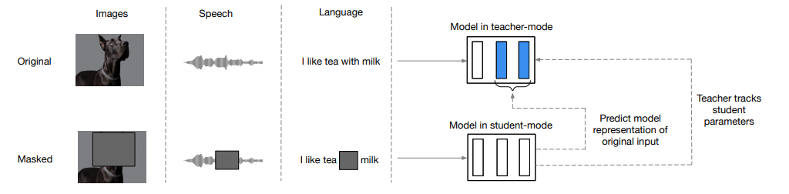

# Data2Vec - Vision

Non official PyTorch implementation of the Self-supervision framework described in
the [data2vec: A General Framework for Self-supervised Learning in Speech, Vision and Language
](https://arxiv.org/abs/2202.03555) paper.

At the time writing this, the FAIR team has not yet published an 
[official implementation](www.github.com/pytorch/fairseq/tree/master/examples/data2vec)
of the data2vec framework for vision (hence not pre-trained weights).



## Example 🖼

```python
import data2vec_vision as d2v
import torchvision.transforms as T

tfms = T.Compose([
    T.Resize((224, 224)),
    T.ToTensor(),
    T.Normalize(mean=[0.485, 0.456, 0.406], std=[0.229, 0.224, 0.225]),
    d2v.transforms.ViTPatchesTransform(patch_size=16),
    d2v.transforms.PatchesToSequence(),
])

model = dv2.Data2Vec.from_pretained("...")

url = "https://www.rover.com/blog/wp-content/uploads/2019/09/cachorros.jpg"
im = Image.open(requests.get(url, stream=True).raw)
im_tensor = tfms(im).unsqueeze(0)

features, hidden_states = model(im_tensor)
# features_shape [BATCH, SEQUENCE_LENGTH, HIDDEN_DIM]
# hidden_states [N_ENCODERS, BATCH, SEQUENCE_LENGTH, HIDDEN_DIM]
```

## Training the model

Launch the following command.

```
$ python -m data2vec_vision train --help
Usage: __main__.py train [OPTIONS] INPUT_PATH

Options:
  --image-size INTEGER            Initial image size, before splitting it into
                                  patches.

  --patch-size INTEGER            Images will be splitted in patches of this
                                  size.

  --epochs INTEGER                Number of training epochs.
  --batch-size INTEGER            Training batch size.
  --n-encoders INTEGER            ViT model number of encoders.
  --dropout FLOAT                 Encoder layers dropout rate
  --hidden-dim INTEGER            ViT hidden number of dimensions.
  --mask-erase-pct FLOAT          Percentage of the image to delete.
  --max-lr FLOAT                  One cycle lr scheduler max learning rate.
  --k INTEGER                     Number of top hidden states to regress.
  --grad-accum INTEGER            Gradient accumulation steps.
  --beta FLOAT                    L1 smooth loss beta.
  --tau-initial FLOAT             Teacher model EMA minimum update factor.
  --tau-end FLOAT                 Teacher model EMA maximum update factor.
  --tau-increase-pct FLOAT        Teacher model EMA factor will increase till
                                  `tau-increase-pct` * `epochs` then will stay
                                  constant.

  --checkpoint-out-dir DIRECTORY
  --resume-checkpoint FILE
  --help                          Show this message and exit.
```

Every 10 epochs, the script will generate a file containing the pretrained model 
with the name `student_{epoch}.pt` (under the `--checkpoint-out-dir`), as well as 
a checkpoint to resume the training at the left point in time (use the 
`--resume-checkpoint` option to resume the training).

If you later want to use the model for feature extraction you can load it as follows:

```python
import data2vec_vision as d2v

image = ...

model = d2v.Data2Vec.from_pretrained("student_99.pt")
features, _ = model(image)  # Features shape: [BATCH, SEQUENCE, FEATURES]
```

## Disclaimer ⚠

This work might be useful for people looking for a stable implementation of 
data2vec under the umbrella of vision paradigm.

I won't be providing pretrained weights of the model because and don't have the 
time nor the money to launch a large scale training.

I've tested this model on small datasets (~10k images) and the results are promising,
even when running one shot tasks without any fine-tuning.